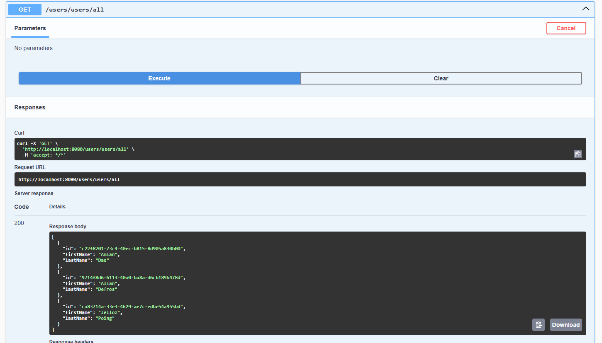
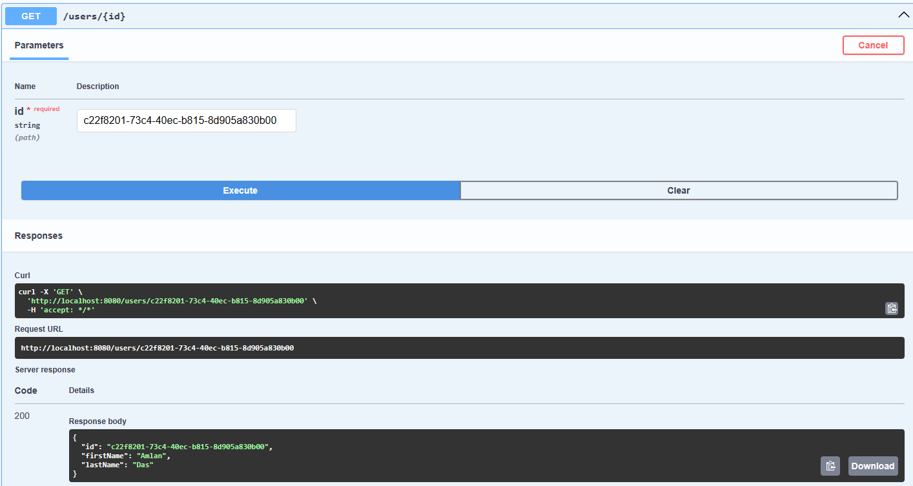
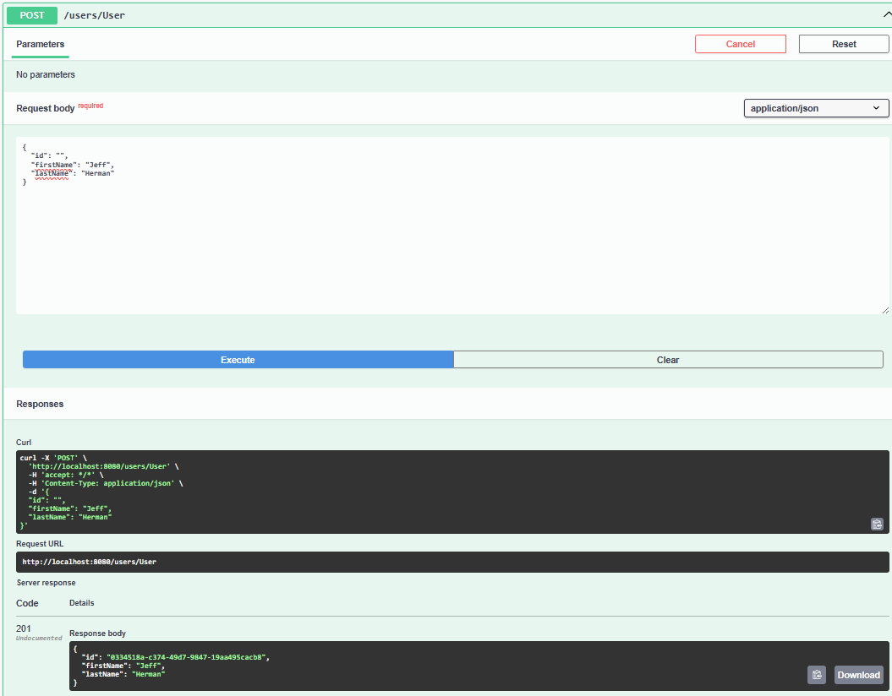
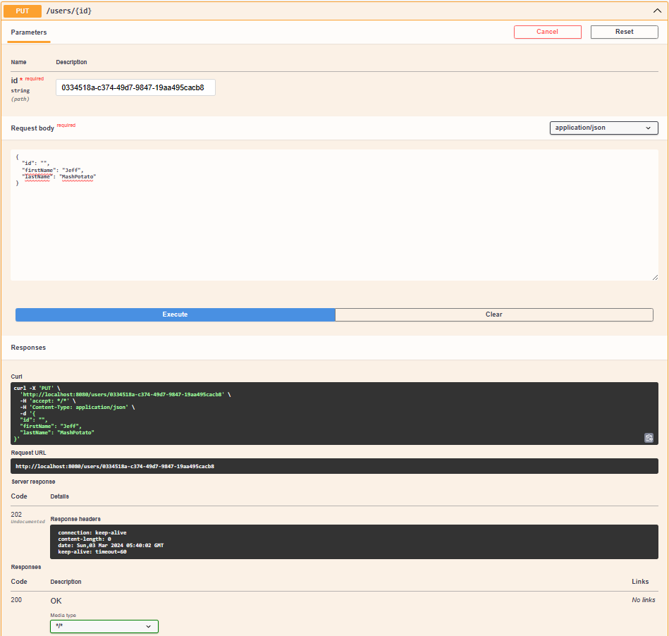
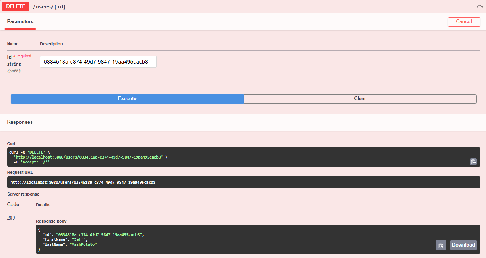

# **User Management Service**

---

A service that handles all the Rest API calls on users data.

---

### Tech Stack
1. Java
2. Spring-Boot
3. Spring-Data-Jpa
4. H2-InMemory-Database
5. Swagger 3

---

### Rest API Calls

> **Get Request="/users/all"**

Request to get all the users details from the table.

> ** Get Request="/users/{id}" **

Request to get a specific user detail by Id from the table.

> ** Post Request="/users/user" **

Request to create user in the table.

> ** Put Request="/users/{id}" **

Request to update user in the table.

> **Delete Request="/users/{id}" **

Request to delete a specific user in the table.

